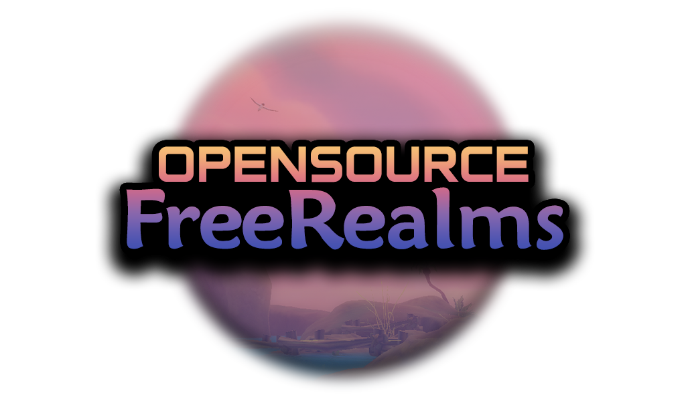

    
    
    
    

Open Source Free Realms is a reversed engineered walking emulator for a now sunset game called Free Realms!

# Installation
 - Download XAMPP, This will allow you start up a local server for you to run around in. : https://www.apachefriends.org/

 - Download the new OSFR server from the releases tab: https://github.com/OpenFreeRealms/OpenFreeRealms/releases

 - After installing XAMPP and OSFR navigate to "C:/xampp/htdocs" and drop the "OSFR" folder inside. This is already preset for future proofing other players.

 - Make sure to startup XAMPP by clicking start on the "Apache" line.

 - Open the "OSFR Server" folder, start up "OFRServer" (Optionally you can create a shortcut for it), Accept all firewall rules that pop-up.

 - Open the "OSFR Client" folder, locate "FreeRealms.bat" and start it up (Optionally you can create a shortcut for it).

 - Enjoy walking around!

# Setting Up
 - Download the OSFR_MP2 file in the repo.
 - Place this file inside of your OSFR Client folder.
 - Have apache running, and open OSFR_MP2.
 - It'll open a black screen that asks you to input an address. Paste the server address of the person hosting the server. When someone's server is online and available to be connected to, they'll post the address in #shouts. After you pasted that address, click enter.
 - Then it'll ask you to type the Character Appearance Name you wish to use. Type in whatever name you want to have visible on your character. VERY IMPORTANT: If you want your character to be customized, you must send your Fallback.json to the server hoster. They will link your json to your name that you want. Whenever you connect to the server, you must type in this name in the Character Appearance Name section. You MUST have the most recent PacketSendSelfToClient.json (the Fallback.json) downloaded or else people wont be able to see your character in the server. To do this correctly, download the linked Fallback.json. Open it and edit your character customization on it (most added in items wont show up in MP, so try to use items already in the inventory unless you want your torso to be see through), save it, and send it to the server hoster. DO NOT replace your original PacketSendSelfToClient.json in your server folder with the fallback, this will break your game. Keep the Fallback.json in your downloads or on your desktop, not in any osfr folder.
 - Click enter, and then you'll be launched into the game! If the loading screen is taking a while, I suggest closing out and trying again. If it still doesn't work after you try again, your internet may be sending corrupt packets to the server and not letting you enter. If you're having any issues connecting, you can ask in #client-support however if the problem is your internet, there may be little we can do to help fix it. 

# Customization
You can freely customize your character within the PacketSendSelfToClient.json and ClientItemDefinitions.json
These 2 documents are half documented so feel free to explore yourself or ask on the discord.

# Tasks
- [x] Fix Disconnects with the current library
- [ ] [Revamp Server Module](https://github.com/OpenFreeRealms/OpenFreeRealms/issues/3)
- [ ] Continue mapping SendSelf and ItemDefinitions

This project has no affiliation with Daybreak Games. All rights and intellectual property belong to them.

This is a standalone project that allows anyone to help. Our main goal is to get a working stable singleplayer emulator out so everyone can enjoy Sacred Grove again.
